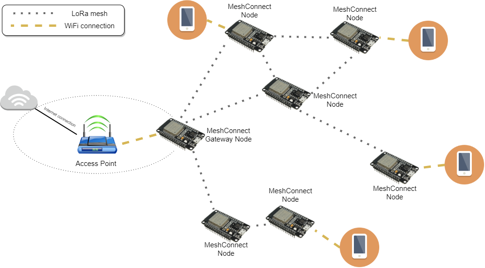
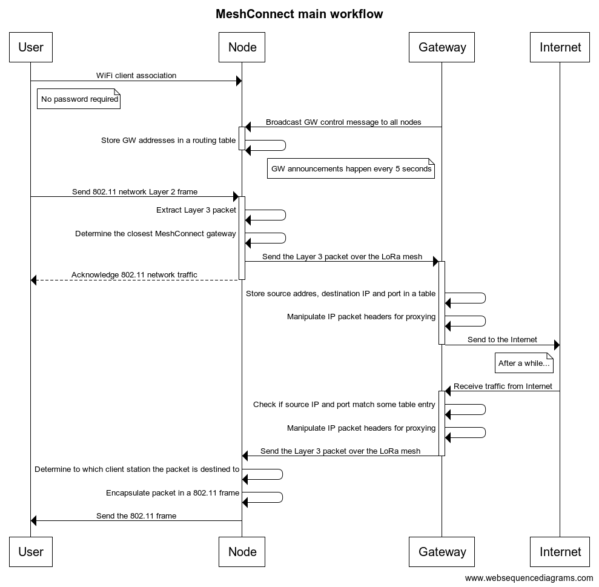

# Mesh Connect
Mesh Connect is a project that aims to deliver a low cost communication infrastructure to areas that have no Internet connectivity at all. The project relies on low cost ESP32 devices with WiFi and LoRa radios. The role of WiFi connectivity is to allow any smartphone or PC to consume the Internet service provided by the ESP32 devices, which will form a mesh network through LoRa, delivering data over long distances with no need of an expensive infrastructure. Naturally, LoRa radios do not provide a large network throughput, but it is enough to allow basic texting applications to be used by the end users that live in areas with no Internet connectity at all.

## Topology overview
Each ESP32 that joins the Mesh Connect network topology can assume one of two roles:
- **Node**, a device that will become an WiFi Access Point that provides Internet connectivity to any device within the range. Nodes send any incoming TCP/IP traffic to Gateway nodes through the LoRa mesh.
- **Gateway**, a device that will connect to an existing WiFi Access Point that is somehow connected to the Internet. It receives traffic from other Nodes through the LoRa mesh and route it to the Internet using its WiFi connection. 

### How do devices become nodes or gateways?
When the device starts, it scans the WiFi SSIDs available in its range. If there is a network named as *MeshConnectGWAP* with no authentication required, it will automatically try to become a WiFi client of such network, thus becoming a Gateway. Otherwise it will become a node and establish communication with peering nodes through the LoRa mesh network.

## Main workflow
In order to forward TCP/IP traffic over the LoRa mesh network, Nodes and Gateway have a common set of operations they need to perform in order to establish proper communication. Here follows the main workflow of each node/gateway in the topology:

## Supported hardware
This project is being developed on:
- TTGO LoRa32-OLED V1
- TTGO T-Beam v1.0 ESP32 LoRa WiFi GPS NEO-6M
